<h1> 
UNIVERSIDAD DE SAN CARLOS DE GUATEMALA
</h1>
<h2>
FACULTAD DE INGENIERIA
<br>
ESCUELA DE CIENCIAS Y SISTEMAS
<br>
ARQUITECTURA DE COMPUTADORAS Y ENSAMBLADORES 1
<br>
SEGUNDO SEMESTRE 2026
<br>
SECCION B
<h2>
<h2>
Juan Pablo Pérez Búc
<br>
201807201
</h2>


# PRACTICA UNICA

## Pruebas unitarias 

**SUMA**
---
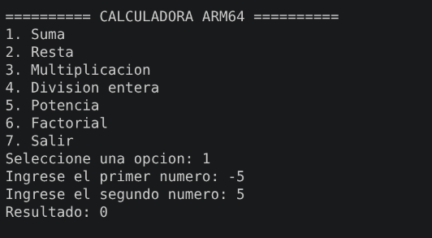

**RESTA**
---
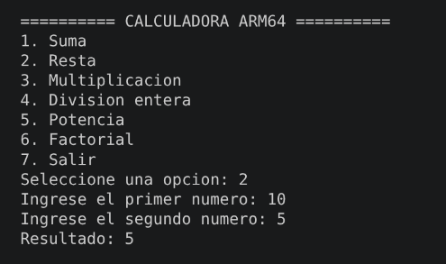

**MULTIPLICACION**
---
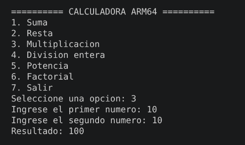

**DIVISION NORMAL**
---
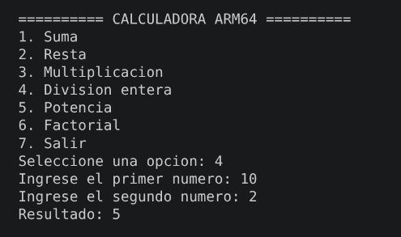

**DIVISION ENTRE 0**
---
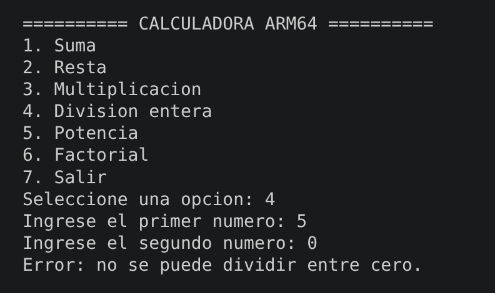

**POTENCIA NORMAL**
---
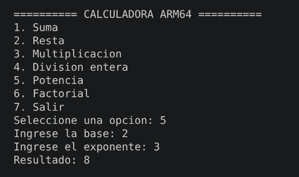

**POTENCIA NEGATIVA**
---
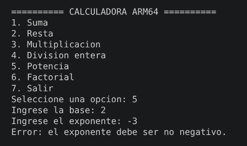

**FACTORIAL 0**
---
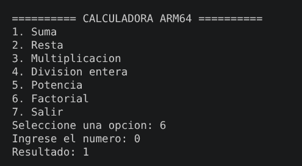

**FACTORIAL 5**
---
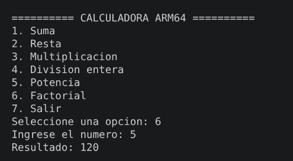

**PRUEBA MENU ERROR**
---
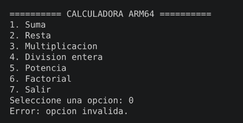

**SALIR DE CALCULADORA**
---
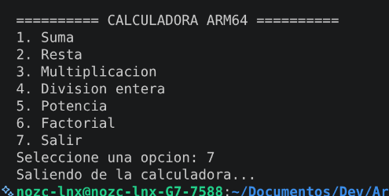

## Evidencia de depuración con GDB

Para verificar el correcto funcionamiento del programa desarrollado en ensamblador ARM64, se ejecutó el proceso de depuración utilizando **GDB Multiarch** en conjunto con **QEMU AArch64**.

La prueba realizada corresponde a la operación de suma utilizando los valores `5` y `10`. El objetivo de la depuración fue observar el contenido de los registros antes y después de ejecutar la instrucción ARM64 encargada de realizar la suma.

### Evidencia 1: Estado de los registros antes de realizar la suma

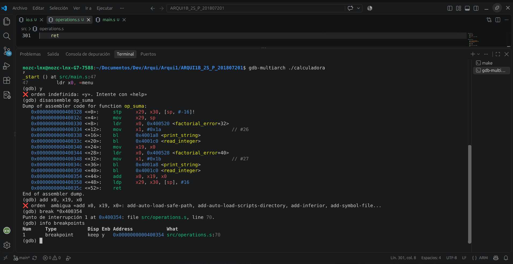
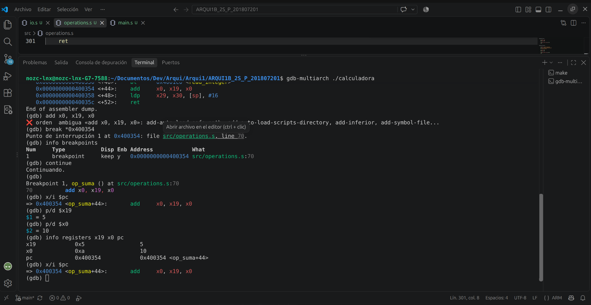

En estas capturas se observa que la ejecución se encuentra detenida mediante un **breakpoint** dentro de la operación `op_suma`, específicamente antes de ejecutar la siguiente instrucción:

```
add x0, x19, x0
```

Mediante GDB se inspeccionaron los registros involucrados en la operación. En este punto se observa que:

- El registro `x19` contiene el valor decimal `5`, correspondiente al primer operando.
- El registro `x0` contiene el valor decimal `10`, correspondiente al segundo operando.
- El registro `pc` apunta a la instrucción `add` que realizará la suma.

Por lo tanto, antes de ejecutar la instrucción se tiene:

```
x19 = 5
x0  = 10
```

La instrucción:

```
add x0, x19, x0
```

realizará la operación:

```
5 + 10
```

y almacenará el resultado en el registro `x0`.

---

### Evidencia 2: Estado de los registros después de realizar la suma

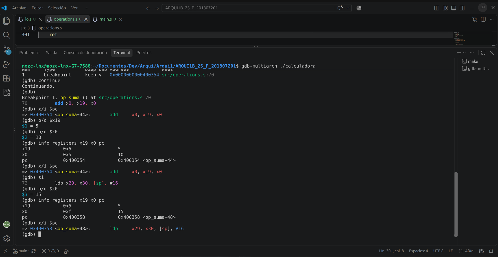

Para ejecutar únicamente la instrucción de suma se utilizó el comando `si` (*step instruction*) de GDB. Con este comando se avanzó una sola instrucción de ensamblador.

Después de ejecutar:

```
add x0, x19, x0
```

se volvió a consultar el contenido de los registros.

El registro `x0`, que anteriormente contenía el segundo operando (`10`), ahora contiene el resultado:

```text
x0 = 15
```

En representación hexadecimal, el mismo valor corresponde a:

```
0xf
```

Esto permite comprobar directamente que la instrucción ARM64 ejecutó correctamente la operación:

```
5 + 10 = 42
```

También se observa que el registro `pc` avanzó hacia la siguiente instrucción, confirmando que la instrucción `add` ya fue ejecutada.

---

### Evidencia 3: Resultado de la operación en la calculadora

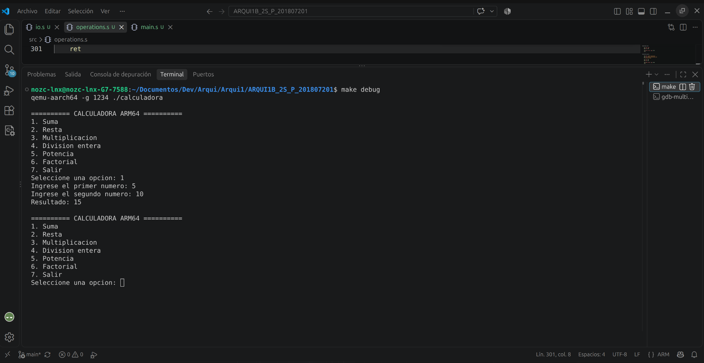

Finalmente, se continuó con la ejecución normal del programa.

En la consola de la calculadora se observa la selección de la opción correspondiente a la suma y el ingreso de los siguientes operandos:

```text
Primer número: 5
Segundo número: 10
```

El programa muestra como resultado:

```text
Resultado: 15
```

Posteriormente, la calculadora vuelve a mostrar el menú principal, permitiendo seleccionar una nueva operación sin finalizar la ejecución del programa.

Esta prueba permite verificar que el resultado presentado al usuario corresponde con el valor `15` observado previamente en el registro `x0` durante la sesión de depuración.

### Conclusión de la depuración

La sesión de depuración permitió observar el flujo de ejecución de la subrutina `op_suma` y comprobar directamente el comportamiento de los registros utilizados por el programa.

Antes de ejecutar la instrucción de suma se tenían los valores:

```
x19 = 5
x0  = 10
```

Después de ejecutar la instrucción:

```
add x0, x19, x0
```

se obtuvo:

```
x0 = 15
```

Finalmente, el mismo resultado fue mostrado en la consola de la calculadora.

Con esta prueba se comprobó mediante GDB que la operación de suma se ejecuta correctamente utilizando instrucciones y registros ARM64.
